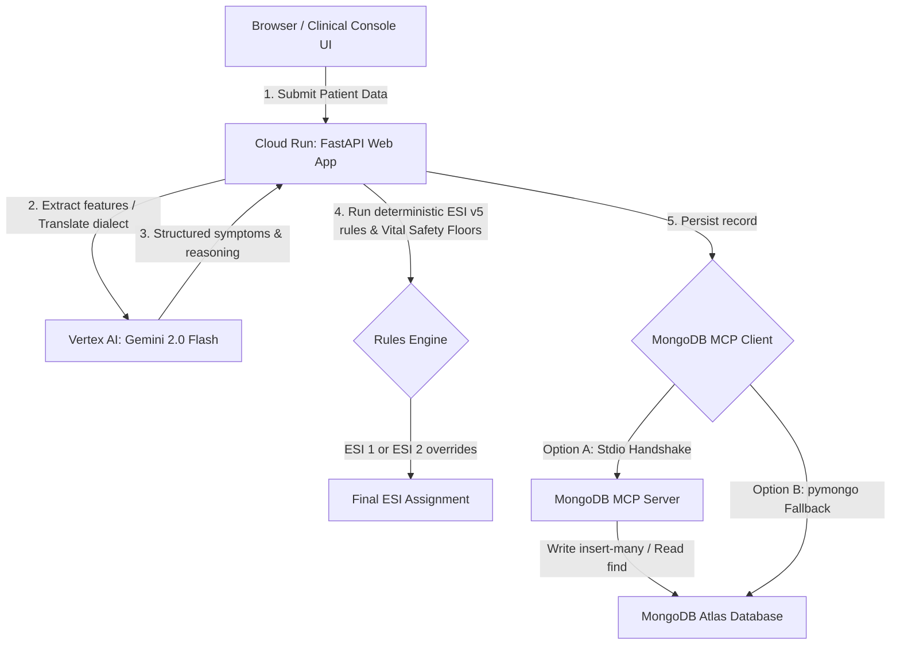

# 🩺 SAFE-Triage Agent — MongoDB Track

**Live Hosted Console & API:** [https://safe-triage-mongodb-api-566848331149.us-central1.run.app](https://safe-triage-mongodb-api-566848331149.us-central1.run.app)  
**GitHub Repository:** [https://github.com/DrAhmed7887/safe-triage-mongodb-agent](https://github.com/DrAhmed7887/safe-triage-mongodb-agent)

SAFE-Triage Agent is a bilingual (English / Egyptian Arabic) emergency department clinical decision-support system built for the **Google Cloud Rapid Agent Hackathon**. It solves a major safety gap in AI-assisted healthcare: while large language models are exceptional at parsing unstructured medical complaints in local dialects, they are prone to clinical omission and under-triage. By combining natural language feature extraction via Vertex AI (Gemini 2.0 Flash) with a deterministic rules engine enforcing ESI v5 guidelines and vital-sign safety floors, the system guarantees 0% critical under-triage. Every triage decision is persisted using the new MongoDB MCP Server protocol, with a native pymongo driver as a hot-standby fallback.

---

### 🏥 Clinical Safety & Legal Disclaimer
> [!IMPORTANT]
> **RESEARCH PROTOTYPE ONLY**  
> This system is built as a research prototype and demonstration of agentic AI technology. It is **not a certified medical device**, has not been cleared for clinical diagnostic use by any regulatory body (such as the FDA or the Egyptian Ministry of Health), and must never be used as a standalone decision-maker. The **attending clinician retains final authority and absolute oversight** over all emergency department triage levels assigned to patients.

---

### 🌐 System Architecture Flow

The system flows seamlessly from the user interface down to MongoDB Atlas:



1. **Browser / Console UI**: A responsive, dark-mode dashboard allows clinicians to input patient demographics, unstructured chief complaints (supporting English and Egyptian Arabic), and vitals.
2. **FastAPI Web App (Cloud Run)**: Serves both the console UI and API endpoints (`/triage`, `/cases`, `/health`).
3. **Vertex AI (Gemini 2.0 Flash)**: Performs clinical entity extraction and Arabic-to-English translation using Application Default Credentials (ADC) without exposing hardcoded API keys.
4. **Deterministic Rules Engine**: Applies strict ESI v5 rules and vital safety floors. If a patient shows critical vitals (e.g. GCS < 9, SpO2 < 90%) or triggers a red-flag symptom (e.g., chest pain), they are automatically locked into ESI Level 1 or 2, preventing any under-triage.
5. **MongoDB MCP Client**: Handles persistence through the **MongoDB MCP Server** over stdio. If Node or the MCP server is unavailable, it gracefully routes requests via a native **pymongo** driver to **MongoDB Atlas**.

---

### 🔌 MongoDB MCP Server Integration

The agent integrates the **MongoDB MCP Server** (`github.com/mongodb-js/mongodb-mcp-server`), satisfying the partner-MCP server requirement for the MongoDB track.

**MCP tools utilized (confirmed against live Atlas cluster):**

| Tool | Operation |
| :--- | :--- |
| `insert-many` | Persists a new triage case record to `safe_triage.triage_cases` |
| `find` | Retrieves recent cases (sorted by timestamp descending) or filters by ESI level |
| `count` | Health probe — confirms that the MCP server and Atlas cluster are reachable |

**Fallback Architecture**:
* On every triage submission (`POST /triage`) or history load (`GET /cases`), the app attempts to execute the query through the MCP server stdio process via the official Python `mcp` SDK.
* If the stdio transport fails, Node is missing, or the Atlas connection times out, a `MongoDBMCPError` is caught, and the system automatically falls back to native `pymongo` client operations.
* The API returns a `"persistence"` flag (`"mongodb_mcp_server"` or `"pymongo_fallback"`) displayed on the dashboard for auditability.

---

### ⚡ Google Cloud / Vertex AI Integration

* **Gemini 2.0 Flash**: Utilized as the reasoning core to structure unstructured patient narratives and translate Egyptian Arabic idioms.
* **Vertex AI SDK**: Directly integrated using the official Python client.
* **Zero Secrets Policy**: The application operates entirely using Google Cloud Application Default Credentials (ADC) in production and local authentication. No `GEMINI_API_KEY` or third-party keys are committed.

---

### ⏱️ Run in <5 Minutes (Local Quickstart)

Follow these steps to run the complete FastAPI backend and reactive clinical console UI locally:

#### 1. Clone & Set Up Directory
```bash
git clone https://github.com/DrAhmed7887/safe-triage-mongodb-agent.git
cd safe-triage-mongodb-agent
python3 -m venv venv
source venv/bin/activate
```

#### 2. Install Dependencies
```bash
pip install -r requirements.txt
```

#### 3. Configure Environment Variables
Create a local `.env` file from the example:
```bash
cp .env.example .env
```
Open `.env` and fill in:
* `MONGODB_URI`: Your MongoDB Atlas connection string.
* `GCP_PROJECT_ID`: Your Google Cloud Project ID.
* *Note: Ensure your terminal is authenticated with Google Cloud using `gcloud auth application-default login` so Vertex AI can be accessed locally.*

#### 4. Run the Combined Application
FastAPI serves the frontend directly at the root URL `/`. Start the server using:
```bash
PYTHONPATH=. uvicorn backend.main:app --host 127.0.0.1 --port 8080 --reload
```
Open your browser and navigate to **[http://127.0.0.1:8080](http://127.0.0.1:8080)** to interact with the clinical console!

#### 5. Verify the Installation & Tests
Ensure that the safety test suite (verifying 0% critical under-triage across all scenarios) passes:
```bash
PYTHONPATH=. pytest tests/test_safety.py -v
```
To run the database seeding script:
```bash
PYTHONPATH=. python scripts/seed_mongodb.py
```
